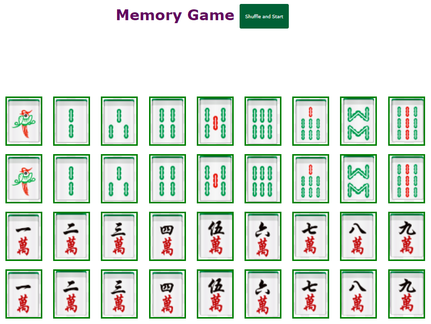

# ***Mahjong Memory Game***

 

### **Objective :**

An app allows you to strengthen your brain !  Find the matching pairs that show mahjong tiles.

 

### **Author :**

Emily Mo

 

### **Process :**

Start the Bill amount, tip percentage and number of patrons to split the bill are shown for entry.  Enter these figures and the following will be provided :

- tip amount per patron

- and total bill amount per patron

  

### **About this app :**

Technical features used :

- HTML/CSS/Bootstrap, 
- javascript,
- and JQuery

  

### Deployment :

This app is deployed in S3.  And its URL is : 

http://mahjong-memory-game.s3-website.us-east-2.amazonaws.com/

